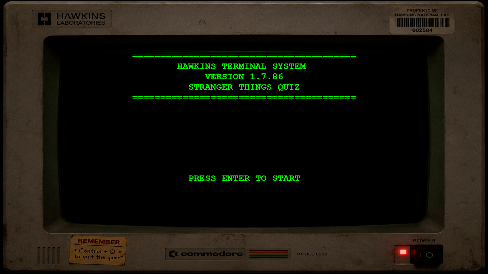

# 🎮 The Ultimate Stranger Things Quiz

A fan-made trivia game inspired by the Netflix series **Stranger Things**.

Test your knowledge of Hawkins, the Upside Down, Demogorgons, Eleven, Vecna, and many other characters and events from the show.

## 📖 About the Project

This project was created as the final project for **Stanford Code in Place 2026**.

The goal was to build a complete interactive game using the Python concepts learned during the course, including:

- Variables
- Functions
- Conditionals
- Loops
- User input
- Score tracking
- Game logic

## ✨ Features

- Multiple-choice trivia questions
- Stranger Things themed interface
- Score system
- Retro-inspired experience
- Custom graphics and assets
- Easy to play

## 🕹️ How to Play

1. Run the Python program.
2. Read each question carefully.
3. Select your answer.
4. Try to achieve the highest score possible.
5. Find out if you're a true Stranger Things fan!

## 🛠️ Built With

- Python
- Stanford Code in Place
- Custom graphics

## 📸 Screenshots

  ## Screenshot

## 👨‍💻 Author

**Diego Lasso**

## ⭐ Acknowledgements

Created as part of the Stanford University Code in Place program.

Stranger Things is a trademark of Netflix. This project is a non-commercial fan project created for educational purposes only.
